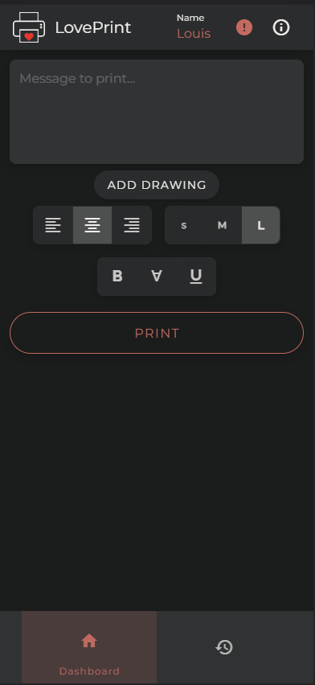
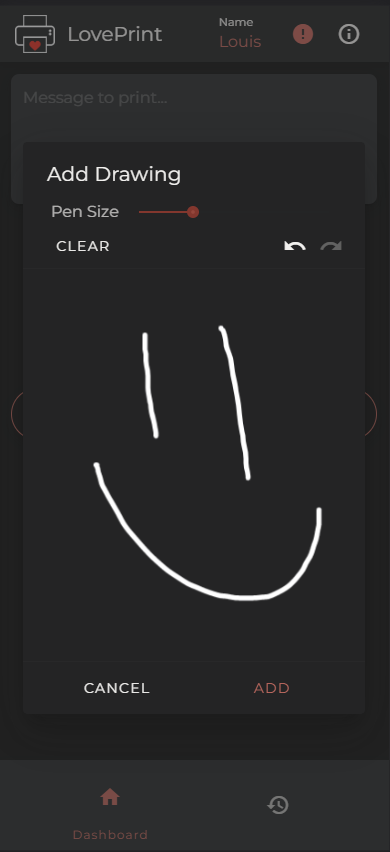
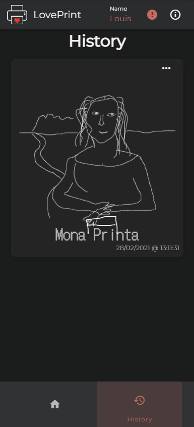

# LovePrint
## What is it?
It's an internet connected receipt printer, intended to be run from a Raspberry Pi. It supports printing messages and drawings from around the world. 

The frontend is written with Vue 3 & Vuetify, with mobile-first design principles. It is deployed as a progressive web app (PWA) and can therefore be run on any device with an internet connection.

[The backend](https://github.com/LouisH98/loveprint-api) is written in Python with Flask & Flask-API as the REST API framework.

## Features
### Mobile-First UI


From this screen, we can see the input field for entering a messages, along with some formatting options, and a place to add a drawing.
You can also see the connection status to the printer in the top-right, along with a what's new button.

### Drawing


After clicking/tapping the add drawing button, a dialog appears where you can create your masterpieces! The pen size can be adjusted, and if any mistakes are made, there is also the ability to undo/redo the last modifications.

### Printing


After finishing the drawing, you can choose to remove or download the drawing, or add a message and send both over to the printer, where they will be immediately printed into a physical form!

### History


All your 'art' 😉  is then saved into the history tab, allowing you to look back at every message you've sent, with the option to remove or re-print them!

## Project setup
```
npm install
```

### Compiles and hot-reloads for development
```
npm run serve
```

### Compiles and minifies for production
```
npm run build
```

